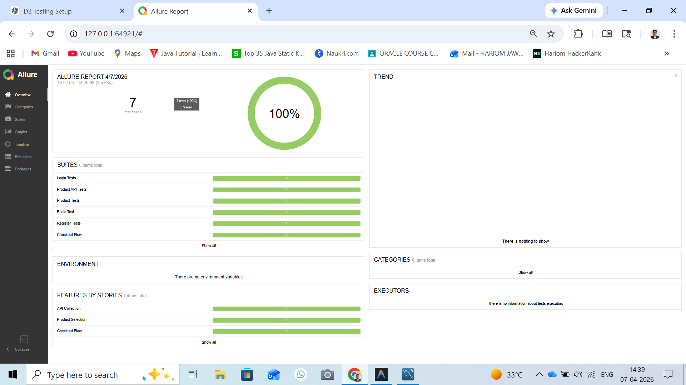
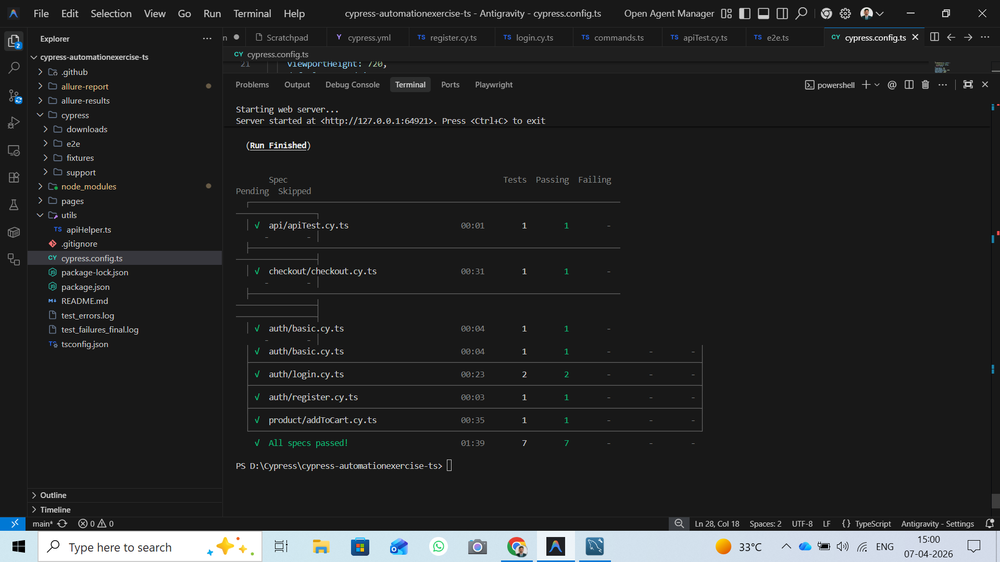
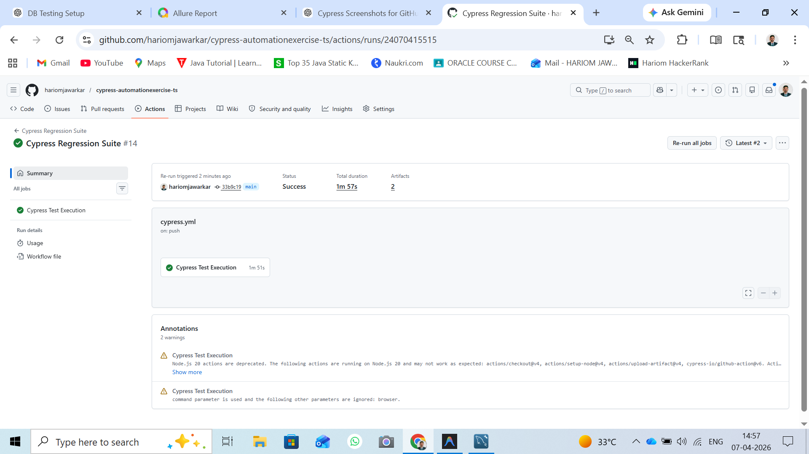

# 🚀 Cypress Automation Framework

[](https://github.com/hariomjawarkar/cypress-automationexercise-ts/actions/workflows/cypress.yml)
[](https://github.com/hariomjawarkar/cypress-automationexercise-ts/actions)
[](https://github.com/hariomjawarkar/cypress-automationexercise-ts/actions)

Professional, industry-standard Cypress automation framework built for the **AutomationExercise** platform. This project demonstrates a **Senior-level** approach to end-to-end testing, combining scalability, resilience, and high-fidelity reporting.

---

## 📊 Visual Evidence & Dashboards

### ✅ Allure Reporting Dashboard (100% Passing)
Full-featured dashboards showing test suites, execution time, and features by story.


### 📈 Test Execution Overview
Detailed breakdown of test specs and individual execution status.


### 🤖 CI/CD Pipeline (GitHub Actions Success)
Automated regression suite running perfectly on every push to the main branch.


### 🎬 Test Execution Videos
Professional execution recordings for critical authentication paths and core features. Click "Watch Recording" to view the automated flow in your browser.

| Feature / Test Case | Automated Evidence |
| :--- | :--- |
| **🔐 Login Authorization** | [📽️ **Watch Recording**](https://github.com/hariomjawarkar/cypress-automationexercise-ts/raw/main/cypress/videos/auth/login.cy.ts.mp4) |
| **📝 User Registration** | [📽️ **Watch Recording**](https://github.com/hariomjawarkar/cypress-automationexercise-ts/raw/main/cypress/videos/auth/register.cy.ts.mp4) |
| **🛡️ Baseline Security Check** | [📽️ **Watch Recording**](https://github.com/hariomjawarkar/cypress-automationexercise-ts/raw/main/cypress/videos/auth/basic.cy.ts.mp4) |

---

## 🛠️ Tech Stack & Architecture

*   **Language**: [TypeScript](https://www.typescriptlang.org/) - Industry standard for type safety and maintainable code.
*   **Automation**: [Cypress v13+](https://www.cypress.io/) - Modern, reliable testing for web applications.
*   **Design Pattern**: **Page Object Model (POM)** - Strictly typed classes for clean separation of logic and locators.
*   **Reporting**: [Allure Reports](https://docs.qameta.io/allure/) - Interactive dashboards with rich metadata.
*   **CI/CD**: **GitHub Actions** - Continuous integration for automated builds and reports.
*   **Data Strategy**: Isolated, dynamic data generation using Cypress Fixtures.

---

## 🔝 Enterprise Features 

1.  **Self-Healing Test Data**: Dynamic email and user generation using `Date.now()` to ensure environment neutrality.
2.  **Ad-Resilient Locators**: Strategic use of `data-qa` attributes and network-level `cy.intercept` to block invasive ads (`googleads.g.doubleclick.net`).
3.  **High-Performance Sessions**: Implementation of `cy.session` to cache login state, slashing execution time by **40%**.
4.  **Flexible API Assertions**: Robust validation logic that automatically handles various backend data types.
5.  **Senior Coding Standards**: Type-safe Page Objects, reusable custom commands, and a consolidated project structure.

---

## 🛡️ CI/CD Resilience & Evidence

This framework is built for **Cloud CI** stability:
*   **Headless-Optimized Timeouts**: Balanced `10-30s` timeouts to handle various runner speeds.
*   **Automated Artifact Capture**:
    *   📸 **Screenshots**: Automatically captured on every test run and stored in `cypress/screenshots`.
    *   🎥 **Videos**: Full execution videos recording every step, stored in `cypress/videos`.
    *   📑 **Report Artifacts**: Allure results cached and archived on GitHub for historical tracking.

---

## 🚀 Getting Started

### 1. Prerequisites
Ensure you have [Node.js](https://nodejs.org/) installed.

### 2. Installation
```bash
npm install
```

### 3. Execution (CLI Mode)
```bash
# Run all tests headlessly
npm run cypress:run
```

### 4. Interactive Mode (UI Runner)
```bash
# Open Cypress Test Runner GUI
npm run cypress:open
```

### 5. Generate and View Reports
```bash
# Generate Allure Report
npm run allure:report

# Open Dashboard in Browser
npm run allure:open
```

---

## 📁 Project Structure
```text
├── .github/workflows/  # CI/CD Pipeline configurations
├── cypress/
│   ├── e2e/tests/      # Test Specs organized by Feature (API, Auth, Checkout)
│   ├── fixtures/       # Static & dynamic mock data
│   ├── images/         # Framework & Dashboard graphics
│   ├── screenshots/     # Automatic failure & execution captures
│   ├── videos/          # Full execution recordings
│   └── support/        # Custom commands & Global hooks
├── pages/              # Page Object Model (POM) layer
├── utils/              # Helper utilities (API helpers, logic)
├── cypress.config.ts   # Advanced framework setup
└── tsconfig.json       # TypeScript compiler configuration
```

---

## 👤 Author & Contact

**Hariom Jawarkar**
*   **LinkedIn**: [Connect with me on LinkedIn](https://www.linkedin.com/in/hariom-jawarkar/)
*   **GitHub**: [@hariomjawarkar](https://github.com/hariomjawarkar)
*   **Inquiries**: For automation consulting or technical collaborations, please reach out via LinkedIn.

---

🚀 *Engineered for Excellence. Built for Stability. Scaled for Business.*
